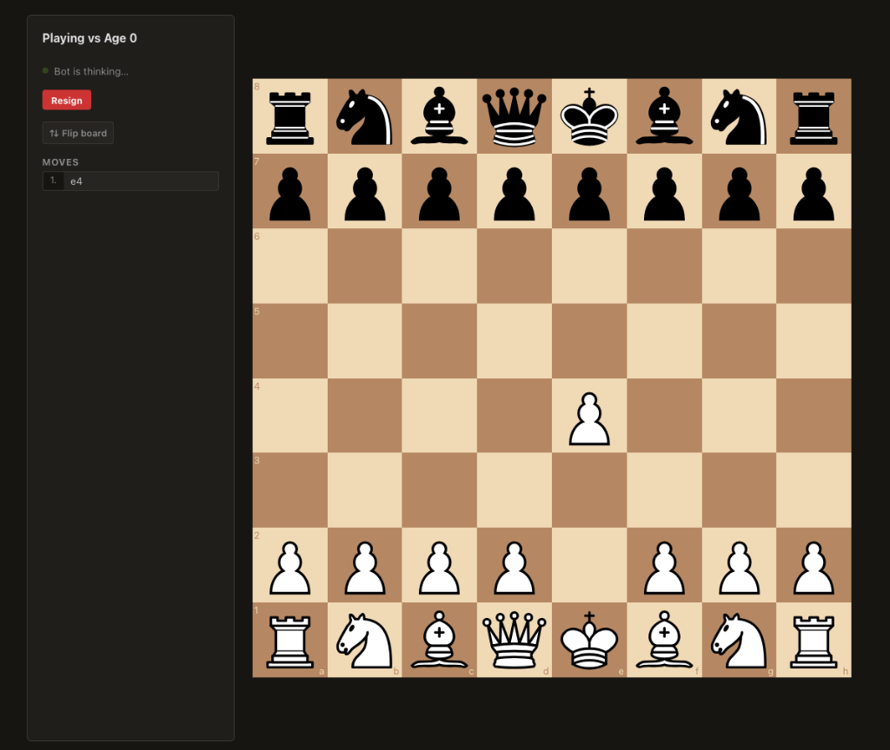
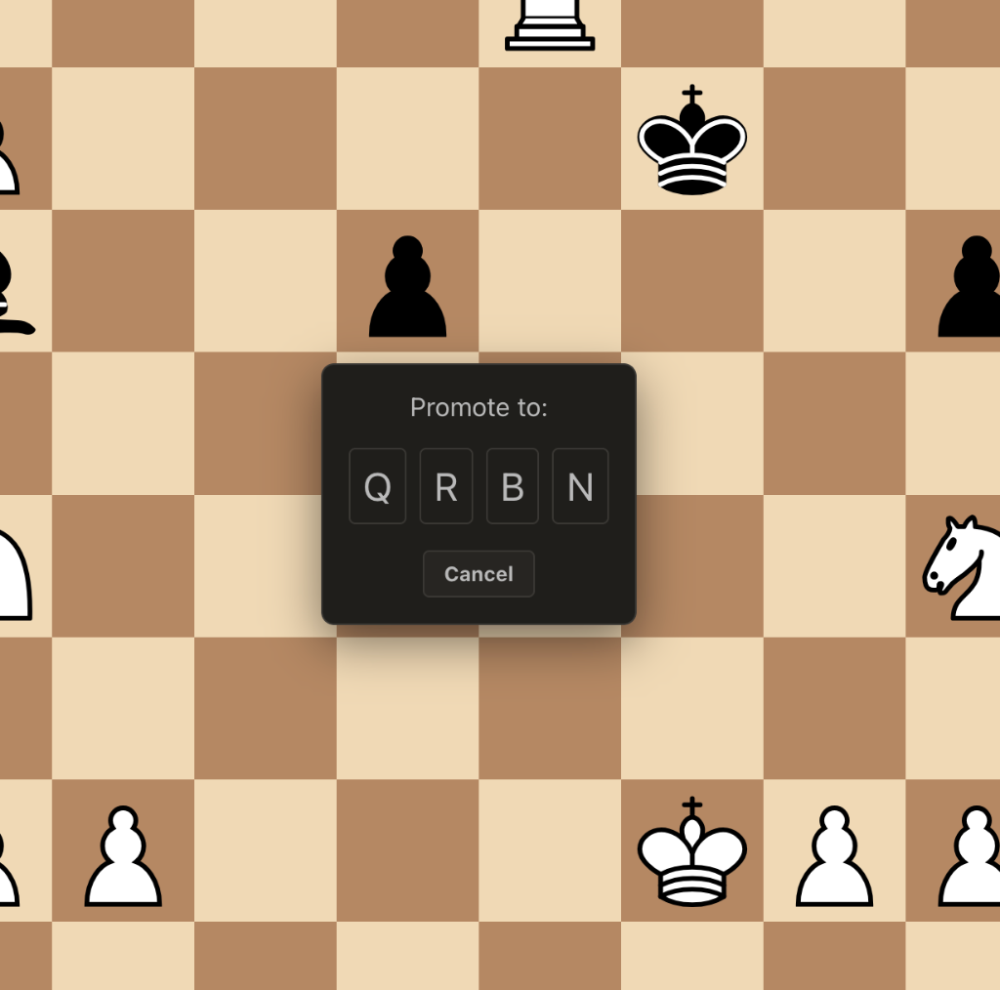

# Plylo ♟️

Plylo is a continuous-learning, AlphaZero-style chess engine with a modern web interface. Unlike traditional chess engines that use hardcoded rules or heuristics, Plylo starts out knowing absolutely nothing except how the pieces move, and learns entirely by playing against itself and against human opponents.



## Features

- **Tabula Rasa Learning:** The engine strictly follows an AlphaZero reinforcement learning approach. No opening books, no endgame tablebases, no hardcoded evaluation functions.
- **Time-Travel (Ages):** The engine snapshots its brain after every game. You can play against "Age 0" (completely random), "Age 100", or the "Latest" generation.
- **Self-Play:** Includes a background trainer and self-play script that continuously generates games and backpropagates the results.
- **Modern React Interface:** A clean, dark-mode web app featuring a fully playable board, legal move validation, move history, and intuitive promotion dialogs.
- **Game Archive:** Review and download the PGN of any game played against the engine.


*Custom promotion dialog built directly into the UI.*

---

## 🏗 Architecture

Plylo is split into two primary components:

### 1. The Backend (Python + PyTorch)
A robust FastAPI server connected to a PostgreSQL database. It handles game state management, serves the REST API, and coordinates the machine learning jobs.
- **Engine (`server/engine/`)**: A pure PyTorch implementation of a deep neural network that evaluates board positions, combined with a custom Minimax/Alpha-Beta search tree.
- **Jobs (`server/jobs/`)**:
  - `worker.py`: Picks up user games and computes the AI's next move in the background.
  - `trainer.py`: Monitors the database for finished games, calculates the win/loss gradient, and backpropagates it into the neural network, creating a new "Age".
  - `self_play.py`: A script that forces the bot to play against itself endlessly to generate training data.

### 2. The Frontend (React + Vite)
A highly responsive Single Page Application built with React, Vite, and `react-chessboard`. 


*View past games, check the bot's age at the time, and download PGNs.*

---

## 🚀 Deployment

Plylo is fully containerized using Docker and Docker Compose, making it extremely easy to deploy to production.

### Requirements
- Docker & Docker Compose
- PostgreSQL (or use the included Docker container)

### Quickstart

1. **Clone the repository**
   ```bash
   git clone git@github.com:mkd/plylo.git
   cd plylo
   ```

2. **Start the production stack**
   ```bash
   docker compose -f docker-compose.prod.yml up --build -d
   ```
   This will spin up 4 containers:
   - `plylo-db`: The PostgreSQL database.
   - `plylo-api`: The FastAPI web server.
   - `plylo-worker`: The background worker that plays moves against humans.
   - `plylo-trainer`: The background daemon that trains the PyTorch model on completed games.

3. **Run Self-Play (Optional)**
   To quickly generate experience and let the bot teach itself how to play, run the self-play script inside the worker container:
   ```bash
   nohup docker compose -f docker-compose.prod.yml exec plylo-worker python server/jobs/self_play.py > selfplay.log 2>&1 &
   ```

## 📜 Invariants

Plylo's development strictly adheres to the following maturity invariants:
1. **Exact prefix:** A game against an older age must use only the knowledge from that specific checkpoint.
2. **Frozen game:** The age and model fingerprint never change during a game.
3. **One shared learning stream:** No training branches. All games update the newest learner.
4. **No injected chess expertise:** No pretrained weights, books, tablebases, or hardcoded positional rules.

## 🤝 Contributing
Contributions are welcome! Please ensure any pull requests adhere strictly to the project invariants defined in `.agents/rules/invariants.md`.

## License
MIT License
